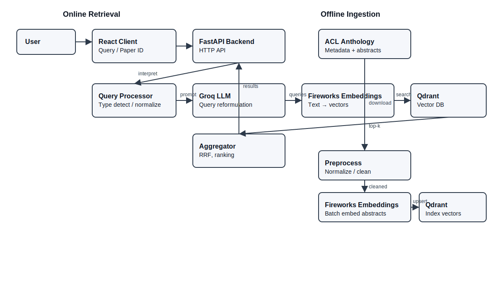

# ACL Anthology Semantic Retrieval System


## Motivation

The ACL Anthology hosts tens of thousands of NLP research papers. Traditional keyword-based search often fails to capture the semantic nuance of research queries, struggling with synonyms, paraphrases, and conceptual similarity. 

**ACL Anthology RAG** bridges this gap by implementing a semantic retrieval system. It moves beyond simple keyword matching to understand the *meaning* behind a query, allowing researchers to discover relevant work even when they don't know the exact terminology.

## Key Features

- **Semantic Search**: Uses dense vector embeddings to find conceptually similar papers.
- **Query Reformulation**: Leverages LLMs to expand user queries into multiple search vectors, improving recall.
- **Dual Query Modes**: Supports both natural language questions and "Paper as Query" (using a paper ID to find related work).
- **Unified Pipeline**: A consistent architecture for handling different types of inputs.
- **Modern Stack**: FastAPI, LangChain, Fireworks (embeddings), Groq (LLM), Qdrant, React.

## Architecture Overview

The system follows a Retrieval-Augmented Generation (RAG) pattern, though currently focused on the retrieval aspect.

Note: Fireworks is used only for embedding generation. LLM-based query reformulation uses Groq.



## Supported Query Modes

### 1. Natural Language Query
**Best for:** Exploratory research, topic discovery.
- **Input:** "How do I improve low-resource translation?"
- **Process:** The system expands this into multiple semantic queries (e.g., "low-resource NMT techniques", "data augmentation for translation").

### 2. ACL Anthology Paper ID
**Best for:** Finding related work, literature review.
- **Input:** `2023.acl-long.412`
- **Process:** The system fetches the abstract of the specified paper and uses it as a semantic proxy to find other papers in the same research neighborhood.

## Offline vs Online Steps

### Offline (Ingestion)
1. **Download**: Metadata and abstracts are fetched from the ACL Anthology.
2. **Preprocess**: Text is cleaned, normalized, and formatted.
3. **Embed**: Dense vectors are generated for each abstract.
4. **Index**: Vectors are stored in Qdrant for fast retrieval.

### Online (Retrieval)
1. **Receive**: User input (text or ID) is received.
2. **Reformulate**: LLM generates multiple search queries.
3. **Retrieve**: Vector search finds candidate papers for each query.
4. **Aggregate**: Reciprocal Rank Fusion (RRF) combines and ranks results.

## Quick Start

### Prerequisites
- Python 3.12+
- Node.js 20+
 - Access to a Qdrant endpoint (local install or Qdrant Cloud)

### Steps

1. **Clone the repository**
   ```bash
   git clone https://github.com/nnayz/acl-anthology-rag.git
   cd acl-anthology-rag
   ```

2. **Configure Environment**
   Copy `.env.example` to `.env` in `api/` and fill in your API keys (Groq/Fireworks).
   ```bash
   cp api/.env.example api/.env
   ```
   Then set Qdrant connection in `api/.env`:
   - Set `QDRANT_ENDPOINT` to your running instance (e.g., `http://localhost:6333` for a local install, or your Qdrant Cloud URL).
   - Optionally set `QDRANT_API_KEY` if using Qdrant Cloud.

3. **Run Backend**
   ```bash
   cd api
   uv sync
   uv run fastapi dev app.py
   ```

4. **Run Frontend**
   ```bash
   cd client
   npm install
   npm run dev
   ```

See [Installation Guide](docs/installation.md) for detailed setup.

## Project Structure

```
.
├── api/                 # Backend (FastAPI)
│   ├── src/
│   │   ├── ingestion/   # Data processing pipeline
│   │   ├── retrieval/   # Search logic & ranking
│   │   ├── llm/         # LLM integration
│   │   └── vectorstore/ # Qdrant interface
├── client/              # Frontend (React)
├── docs/                # Documentation
```

## Documentation Index

- [**Architecture**](docs/architecture.md): Deep dive into system components and design.
- [**Installation**](docs/installation.md): Detailed setup and troubleshooting.
- [**Configuration**](docs/configuration.md): Environment variables and settings.
- [**Usage**](docs/usage.md): How to use the system effectively.
- [**Workflows**](docs/workflows.md): Detailed offline and online pipeline steps.
- [**Evaluation**](docs/evaluation.md): Offline evaluation pipeline, metrics, and reports.

## Limitations

- Operates on abstracts only (no full-text indexing).
- Requires external services: Groq (LLM for reformulation) and a Qdrant endpoint.
- Embedding generation via Fireworks API; throughput and cost depend on API limits.
- Limited quantitative evaluation included (primarily qualitative relevance checks).
- No cross-encoder re-ranking; ranking relies on dense similarity and RRF fusion.
- Not productionized (no auth, observability, or autoscaling in scope).

## Future Work

- Add hybrid retrieval (dense + BM25) and cross-encoder re-ranking.
- Incorporate full-text indexing and PDF parsing.
- Add user feedback loops and relevance learning.
- Improve UI (filters, facets, citations, export options).
- Batch/streaming ingestion pipeline with resumability and monitoring.
- Expand evaluation with curated benchmarks and inter-annotator agreement.

## License

MIT License
