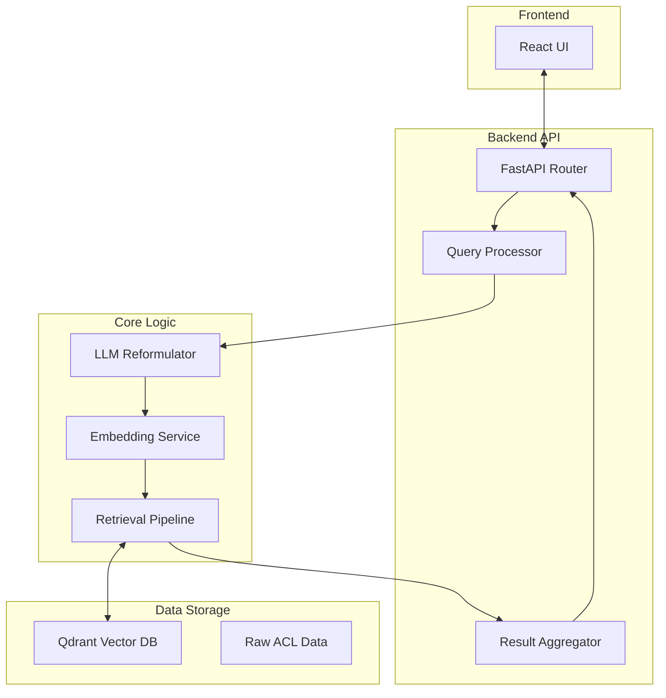

# System Architecture

This document provides a detailed breakdown of the ACL Anthology RAG system architecture, including its major components, design patterns, and data flow.

## High-Level Overview

The system is designed as a modular Retrieval-Augmented Generation (RAG) pipeline. It decouples the offline ingestion of data from the online retrieval of information, allowing for scalable and efficient searching.

## Component Breakdown

### 1. Frontend Client
- **Tech Stack:** React 19, Vite, TailwindCSS, shadcn/ui.
- **Responsibilities:**
  - Accepts user input (Natural Language or Paper ID).
  - Displays retrieved papers with metadata (Title, Abstract, Year, Authors).
  - Visualizes the search process (loading states, query expansion results).
- **Key Components:**
  - `SearchInterface`: Main input component handling mode switching.
  - `ResultCard`: Displays individual paper details.

### 2. Backend API
- **Tech Stack:** FastAPI, Python 3.12.
- **Responsibilities:**
  - Exposes REST endpoints for search.
  - Handles request validation and error management.
  - Orchestrates the retrieval pipeline.
- **Key Modules:**
  - `api/app.py`: FastAPI application entrypoint (Vercel-friendly).
  - `api/src/api/routes.py`: Defines endpoints like `POST /api/search` (SSE) and `GET /api/paper/{paper_id}`.

### 3. Query Processor (`api/src/retrieval/query_processor.py`)
- **Role:** Interprets the raw user input.
- **Logic:**
  - If input is a **Paper ID** (e.g., `2023.acl-long.1`), the pipeline looks up the paper in the Qdrant payload and uses its title/abstract as the basis for generating search queries.
  - If input is **Natural Language**, it passes it directly to the next stage.
- **Design Pattern:** Strategy Pattern (handles different input types uniformly).

### 4. Filter Parser (`api/src/retrieval/filter_parser.py`)
- **Role:** Extracts structured filters (year/authors/etc.), a remaining semantic query, and performs permissive relevance gating.
- **Notes:**
  - Runs before retrieval and can return early for clearly irrelevant queries.

### 5. LLM Reformulator (`api/src/llm/reformulator.py`)
- **Role:** Expands the semantic query into multiple search queries.
- **Logic:**
  - Uses Groq LLM and returns a JSON list of query strings.
  - Improves recall by covering different facets of the information need.
- **Configuration:** Adjustable number of generated queries (default: 3).

### 6. Embedding Service (`api/src/vectorstore/client.py`)
- **Role:** Converts text into dense vectors.
- **Provider:** Fireworks embeddings via LangChain.
- **Model:** Defaults to `nomic-ai/nomic-embed-text-v1.5`.
- **Usage:**
  - **Offline:** Embeds all paper abstracts.
  - **Online:** Embeds the reformulated search queries.

### 7. Retrieval Pipeline (`api/src/retrieval/pipeline.py`)
- **Role:** Executes the search against the vector database.
- **Logic:**
  - Performs nearest neighbor search for *each* of the reformulated queries.
  - Retrieves `k` candidates for each query.

### 8. Result Aggregator (`api/src/retrieval/aggregator.py`)
- **Role:** Merges results from multiple queries into a single ranked list.
- **Algorithm:** Reciprocal Rank Fusion (RRF).
- **Logic:**
  - Assigns scores based on the rank of a paper in each result set.
  - Favors papers that appear in multiple result sets or rank highly in single sets.
  - Deduplicates papers.

### 9. Response Synthesizer (`api/src/llm/reformulator.py`)
- **Role:** Streams a markdown response grounded in the retrieved results.
- **Notes:**
  - Uses bracketed numeric citations like `[1]`, `[2]` aligned to the ranked results.

### 10. Vector Database
- **Tech Stack:** Qdrant (Dockerized).
- **Role:** Stores abstract embeddings and metadata (Title, URL, Year).
- **Schema:**
  - `vector`: 768-dim float array.
  - `payload`: JSON object with paper metadata.

## Design Patterns

### Retrieval-Augmented Generation (RAG)
While typically used for generating answers, here the "Generation" part is primarily used for **Query Expansion**, and the final output is the retrieved documents themselves. This is often called **RAG for Retrieval**.

### Reciprocal Rank Fusion (RRF)
Used to combine results from the multiple generated queries without needing complex re-ranking models. It provides a robust way to fuse rankings.

### Separation of Concerns
- **Ingestion** is strictly offline.
- **Retrieval** is strictly read-only online.
- **Shared Components** (like Embedding) are reused to ensure consistency between indexing and querying.

## Data Flow

### Offline Ingestion Flow
1. **Download**: `acl-anthology` library fetches metadata.
2. **Clean**: Text is normalized (unicode normalization, whitespace stripping).
3. **Embed**: Batches of abstracts are sent to the embedding model.
4. **Upsert**: Vectors + Payload are pushed to Qdrant.

### Online Search Flow
1. **Input**: User provides "Machine Translation".
2. **Parse filters**: LLM extracts structured filters + semantic search intent.
3. **Reformulate**: LLM generates:
   - "Neural Machine Translation state of the art"
   - "Low-resource language translation"
   - "Transformer based translation models"
4. **Embed**: All strings are embedded.
5. **Search**: Qdrant runs multiple searches (one per query).
6. **Fuse**: Hybrid RRF + score fusion combines the ranked lists.
7. **Return**: Results + response are streamed to the UI via SSE.

## Extension Points

- **New Embedding Models**: Change `EMBEDDING_MODEL` in config.
- **Different LLMs**: Switch providers in `api/src/llm/`.
- **Hybrid Search**: Add keyword-based search (BM25) to Qdrant and fuse with dense vectors.
