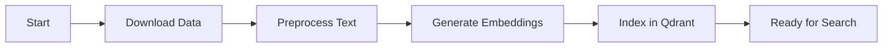
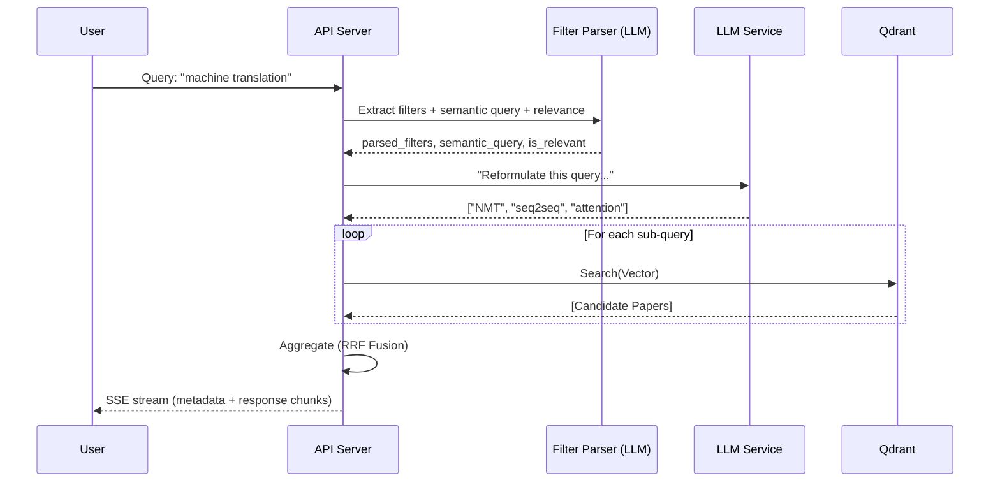

# Workflows & Pipelines

This document details the step-by-step processes for the system's two main phases: Offline Ingestion and Online Retrieval.

## 1. Offline Ingestion Pipeline

The goal of this pipeline is to prepare the ACL Anthology data for semantic search. This is a batch process run periodically (or once).

### Step 1: Download (`src.ingestion.download`)
- **Source**: Uses the `acl-anthology` Python library or direct XML/gzip downloads.
- **Action**: Iterates through the anthology collection.
- **Output**: Raw metadata objects (Title, Abstract, Authors, Year, ID).

### Step 2: Preprocess (`src.ingestion.preprocess`)
- **Input**: Raw metadata.
- **Actions**:
  - **Normalization**: Unicode normalization (NFKC).
  - **Cleaning**: Removal of LaTeX artifacts, excessive whitespace, and special characters.
  - **Filtering**: Drops entries without abstracts (as they cannot be embedded).
- **Output**: Cleaned JSON dataset.

### Step 3: Embedding (`src.ingestion.embed`)
- **Input**: Cleaned abstracts.
- **Model**: `nomic-ai/nomic-embed-text-v1.5` (or configured model).
- **Process**:
  - Batches text inputs.
  - Computes 768-dimensional float vectors.
  - **Note**: This is the most compute-intensive step.

### Step 4: Indexing (`src.ingestion.ingest`)
- **Target**: Qdrant Vector Database.
- **Action**: Upserts (Insert/Update) points into the collection.
- **Payload**: The vector is stored alongside the metadata (Title, ID, etc.) so we don't need a secondary database lookup.

---

## 2. Online Retrieval Pipeline

The goal of this pipeline is to return relevant papers for a user query in real-time.

### Step 1: Filter Parsing + Relevance (`FilterParser`)
- Parses the user query into:
  - `parsed_filters` (e.g., year range, authors, awards)
  - `semantic_query` (the remaining semantic search intent)
  - `is_relevant` (whether the system should proceed)
- If `is_relevant` is false, the pipeline returns early with a helpful message.

### Step 2: Query Interpretation (`QueryProcessor`)
- Checks for an ACL Anthology paper ID either as the entire query or embedded in a longer query.
- If a paper ID is detected, the pipeline looks up that paper and uses its title/abstract to generate search queries.

### Step 3: Semantic Reformulation (`Reformulator`)
- **Prompt**: "You are an AI research assistant. Generate 3 diverse search queries for..."
- **Input**: User query / Paper abstract.
- **Output**: A list of strings representing different semantic angles.

### Step 4: Multi-Query Vector Search (`Pipeline`)
- Each reformulated query string is embedded using the *same* model as ingestion.
- Searches are executed sequentially (embedding model calls are treated as non-thread-safe).
- Each search returns `k` candidates where `k = top_k * SEARCH_K_MULTIPLIER`.

### Step 5: Aggregation & Ranking (`Aggregator`)
- **Algorithm**: Hybrid fusion combining Reciprocal Rank Fusion (RRF) with raw similarity scores.
- **RRF contribution** (per query): `rrf += 1 / (RRF_K + rank)`
- **Final score**: `score = w * avg_similarity + (1 - w) * normalized_rrf`
- **Result**: A deduplicated, re-ranked list of unique papers.

### Step 6: Response (Streaming)
- The server returns a Server-Sent Events (SSE) stream.
- The first event contains `metadata` (results, filters, reformulated queries, timestamps).
- The server then streams response `chunk` events produced by the LLM response synthesizer.
