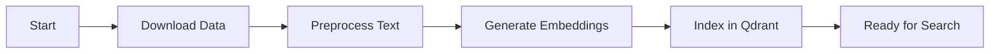
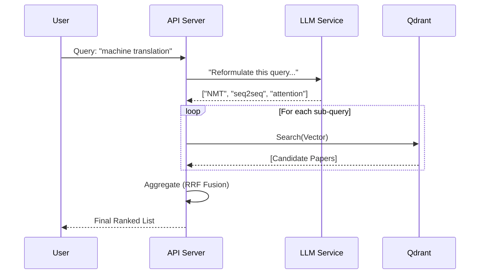

# Workflows & Pipelines

This document details the step-by-step processes for the system's two main phases: Offline Ingestion and Online Retrieval.

## 1. Offline Ingestion Pipeline

The goal of this pipeline is to prepare the ACL Anthology data for semantic search. This is a batch process run periodically (or once).

### Step 1: Download (`src.ingestion.download`)
- **Source**: Uses the `acl-anthology` Python library or direct XML/gzip downloads.
- **Action**: Iterates through the anthology collection.
- **Output**: Raw metadata objects (Title, Abstract, Authors, Year, ID).

### Step 2: Preprocess (`src.ingestion.preprocess`)
- **Input**: Raw metadata.
- **Actions**:
  - **Normalization**: Unicode normalization (NFKC).
  - **Cleaning**: Removal of LaTeX artifacts, excessive whitespace, and special characters.
  - **Filtering**: Drops entries without abstracts (as they cannot be embedded).
- **Output**: Cleaned JSON dataset.

### Step 3: Embedding (`src.ingestion.embed`)
- **Input**: Cleaned abstracts.
- **Model**: `nomic-ai/nomic-embed-text-v1.5` (or configured model).
- **Process**:
  - Batches text inputs.
  - Computes 768-dimensional float vectors.
  - **Note**: This is the most compute-intensive step.

### Step 4: Indexing (`src.ingestion.ingest`)
- **Target**: Qdrant Vector Database.
- **Action**: Upserts (Insert/Update) points into the collection.
- **Payload**: The vector is stored alongside the metadata (Title, ID, etc.) so we don't need a secondary database lookup.

---

## 2. Online Retrieval Pipeline

The goal of this pipeline is to return relevant papers for a user query in real-time.

### Step 1: Query Interpretation (`QueryProcessor`)
- Checks if input matches a Paper ID regex (e.g., `\d{4}\.\w+-\w+\.\d+`).
- **If ID**: Fetches the abstract for that ID to use as the query text.
- **If Text**: Uses the user's text directly.

### Step 2: Semantic Reformulation (`Reformulator`)
- **Prompt**: "You are an AI research assistant. Generate 3 diverse search queries for..."
- **Input**: User query / Paper abstract.
- **Output**: A list of strings representing different semantic angles.

### Step 3: Parallel Vector Search (`Pipeline`)
- Each reformulated query string is embedded using the *same* model as ingestion.
- Multiple searches are run in parallel against Qdrant.
- Each search returns `k` (e.g., 20) candidates.

### Step 4: Aggregation & Ranking (`Aggregator`)
- **Algorithm**: Reciprocal Rank Fusion (RRF).
- **Formula**: `score = 1 / (k + rank)`
- **Logic**: A paper found by multiple query variations gets a higher combined score.
- **Result**: A deduplicated, re-ranked list of unique papers.

### Step 5: Response
- The top `N` papers are returned to the frontend.
- No new text is generated; the system returns the original metadata (Abstract, Title) directly to the user.
